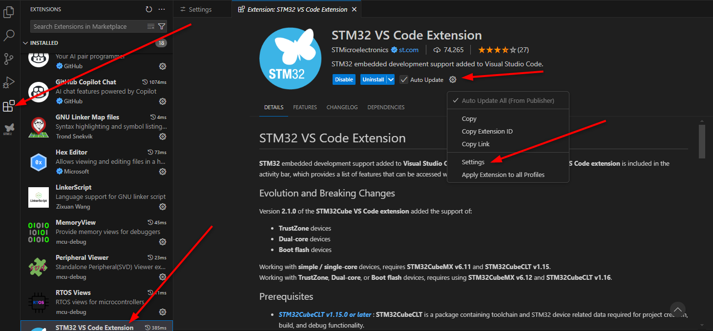
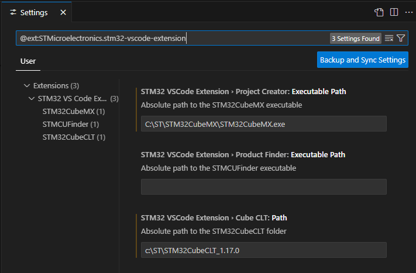
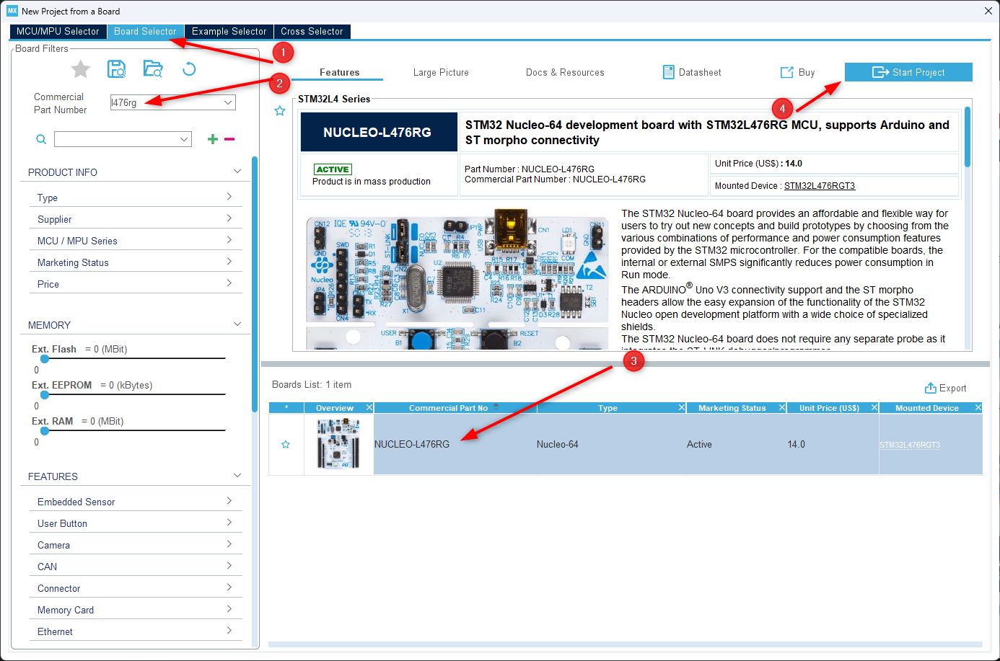
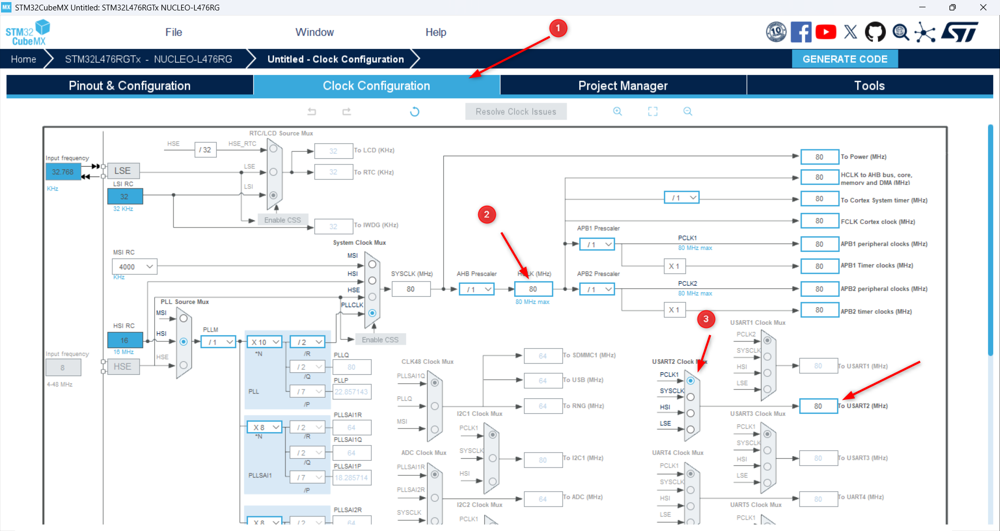
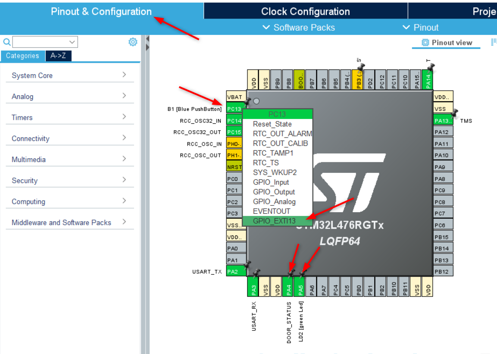
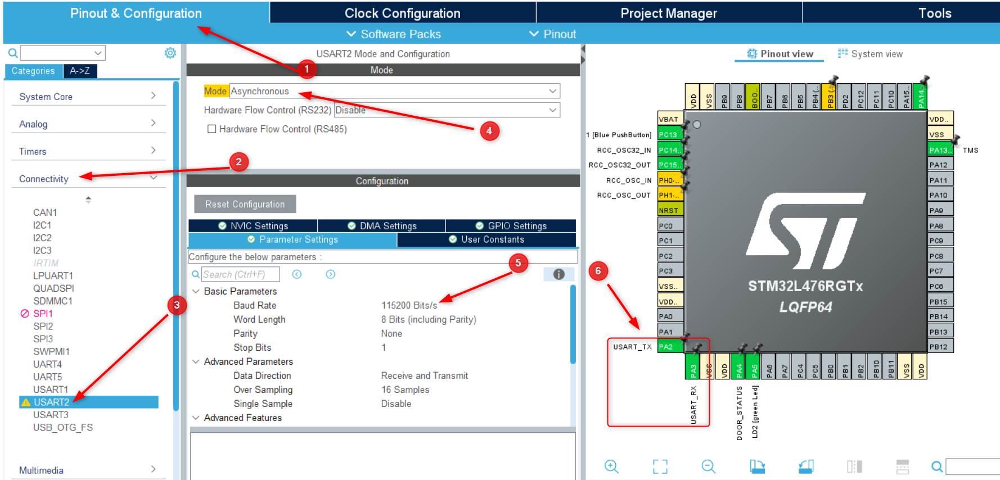
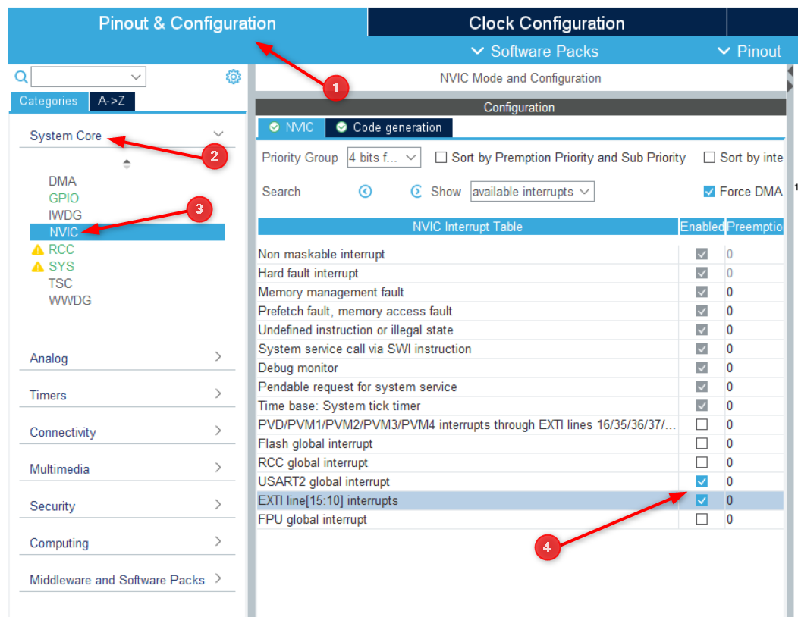
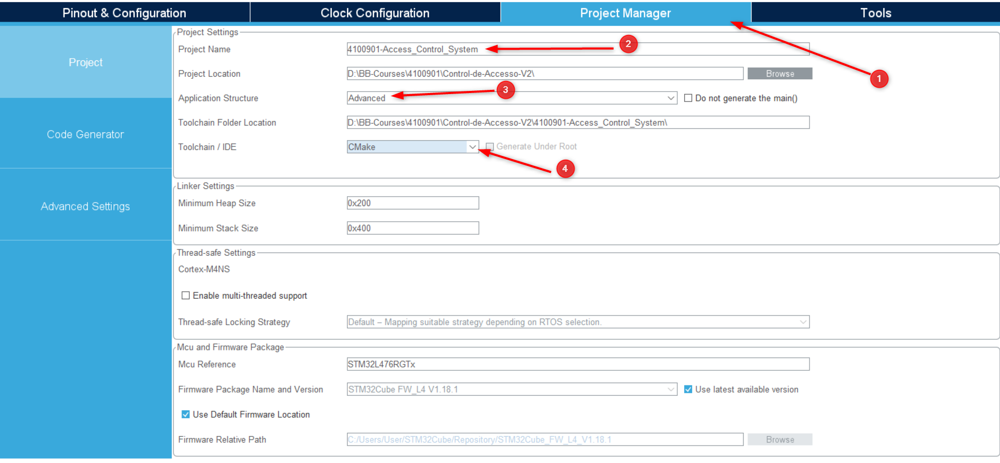
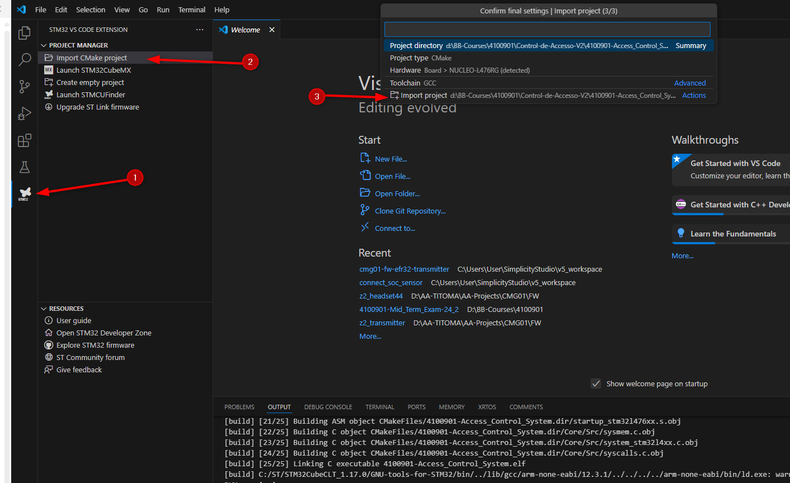

# Guía de Implementación: Sistema de Control de Acceso usando STM32CubeMX

## Introducción

Esta guía te ayudará a implementar un sistema de control de acceso utilizando un microcontrolador STM32L476RG. La configuración inicial se realizará usando STM32CubeMX, lo que simplificará la inicialización de periféricos. El entorno de desarrollo será STM32CubeIDE, que incluye tanto STM32CubeMX como las herramientas de desarrollo necesarias.

El proyecto incluye:
* Una máquina de estados para controlar la puerta
* Comunicación UART (USART2)
* Control de LEDs y detección de eventos de botón
* Temporización usando SysTick

## Sección 0: Instala STM32CubeMX

* Descarga [STM32CubeMX](https://www.st.com/en/development-tools/stm32cubemx.html#st-get-software)
* Instala el software. Puedes seguir este [tutorial en español.](https://www.youtube.com/watch?v=vK0mvabEwDM)
* Añade a STM32 VS Code Extension: Extensions -> STM32 VS Code Extension -> Settings.




## Sección 1: Creación del Proyecto

### 1.1 Configuración Inicial en STM32CubeMX

1. Abre STM32CubeMX
2. Selecciona "New Project"
3. En la pestaña "Board Selector", busca y selecciona "NUCLEO-L476RG"
4. Haz clic en "Start Project"
5. Cuando pregunta si inicializar periféricos por defecto, selecciona "Yes"



### 1.2 Configuración de Periféricos

#### Configuración del Reloj
1. Ve a la pestaña "Clock Configuration"
2. Configura HCLK (MHz) a 80MHz para máximo rendimiento
3. Asegúrate que el USART2 esté usando PCLK1 como fuente de reloj



#### Configuración de GPIO
1. En la pestaña "Pinout & Configuration":
   * PA5 (LED): Configura como "GPIO_Output" (LD2)
   * PC13 (Button): Configura como "GPIO_EXTI13" (B1)
   * PA4: Configura como "GPIO_Output" (LED estado puerta)



#### Configuración USART2
1. En la sección "Connectivity":
   * Habilita USART2
   * Mode: Asynchronous
   * Basic Parameters:
     * Baud Rate: 115200
     * Word Length: 8 Bits
     * Parity: None
     * Stop Bits: 1
   * En NVIC Settings:
     * Habilita "USART2 global interrupt"



#### Configuración EXTI
1. Para PC13 (ya configurado como EXTI13):
   * GPIO mode: External Interrupt Mode with Falling edge trigger detection
   * En NVIC Settings:
     * Habilita "EXTI line[15:10] interrupts"



### 1.3 Generación del Código

1. Ve a "Project Manager":
   * Project Name: `4100901-Access_Control_System`
   * Project Location: Selecciona tu directorio
   * Application Structure: Advanced
   * Toolchain/IDE: CMake
2. Click en "Generate Code"
3. Cuando pregunte si abrir carpeta ("Open Folder"), selecciona "Yes"



### 1.4 Importación del Proyecto en VS Code

1. Abre VS Code y selecciona STM32 VS Code Extension -> Import CMAKE Project
2. Navega hasta la carpeta del proyecto generado y selecciónala
4. Cuando VS Code detecte el proyecto CMake, selecciona "Import Project"
5. Presiona el boton de Build y selecciona la opción "Debug"



## Sección 2: Implementación del Código

### 2.1 Estructura del Proyecto
El proyecto generado tendrá esta estructura:
```
proyecto/
├── Core/
│   ├── Inc/                 # Archivos de cabecera (.h)
│   │   ├── main.h
│   │   ├── state_mahine.h
│   │   └── button.h
│   └── Src/                 # Archivos fuente (.c)
│       ├── main.c
│       ├── state_machine.c
│       └── button.c
├── Drivers/                 # Drivers HAL y CMSIS
└── .project                 # Archivos de configuración IDE
```

### 2.2 Implementación del driver de boton

Crea un nuevo archivo `button.h` en `Core/Inc/`:
```c
#ifndef __BUTTON_H_
#define __BUTTON_H_

#include <stdint.h>

uint8_t detect_button_press(void);

#endif // __BUTTON_H_

```

Crea `button.c` en `Core/Src/`:

```c
#include "button.h"
#include "main.h"

uint32_t b1_tick = 0;

uint8_t detect_button_press(void) {
    uint8_t button_pressed = 0;
    if (HAL_GetTick() - b1_tick < 50) {
        // Ignore bounces less than 50ms
    } else if (HAL_GetTick() - b1_tick > 500) {
        button_pressed = 1; // single press
    } else {
        button_pressed = 2; // double press
    }
    b1_tick = HAL_GetTick();
    return button_pressed;
}

```

### 2.3 Implementación de la Máquina de Estados

Crea un nuevo archivo `state_machine.h` en `Core/Inc/`:

```c
#ifndef STATE_MACHINE_H
#define STATE_MACHINE_H

#include "main.h"

typedef enum {
    LOCKED,
    TEMP_UNLOCK,
    PERM_UNLOCK
} state_t;

typedef enum {
    CMD_NONE = 0,
    CMD_OPEN = 'O',
    CMD_CLOSE = 'C'
} command_t;

void handle_event(uint8_t event);
void run_state_machine(void);
uint8_t button_driver_get_event(void);

#endif

```

Crea `state_machine.c` en `Core/Src/`:

```c
#include "state_machine.h"
#include "main.h"

#define TEMP_UNLOCK_DURATION 5000

static state_t current_state = LOCKED;
static uint32_t unlock_timer = 0;

extern UART_HandleTypeDef huart2;

void handle_event(uint8_t event) {
    if (event == 1) { // Single press
        HAL_UART_Transmit(&huart2, (uint8_t*)"Single press\r\n", 14, 100);
        HAL_GPIO_WritePin(DOOR_STAT_GPIO_Port, DOOR_STAT_Pin, GPIO_PIN_SET);
        current_state = TEMP_UNLOCK;
        unlock_timer = HAL_GetTick();
    } else if (event == 2) { // Double press
        HAL_UART_Transmit(&huart2, (uint8_t*)"Double press\r\n", 14, 100);
        HAL_GPIO_WritePin(DOOR_STAT_GPIO_Port, DOOR_STAT_Pin, GPIO_PIN_SET);
        current_state = PERM_UNLOCK;
    } else if (event == 'O') { // Open command
        HAL_UART_Transmit(&huart2, (uint8_t*)"Open command\r\n", 14, 100);
        HAL_GPIO_WritePin(DOOR_STAT_GPIO_Port, DOOR_STAT_Pin, GPIO_PIN_SET);
        current_state = TEMP_UNLOCK;
        unlock_timer = HAL_GetTick();
    } else if (event == 'C') { // Close command
        HAL_UART_Transmit(&huart2, (uint8_t*)"Close command\r\n", 15, 100);
        HAL_GPIO_WritePin(DOOR_STAT_GPIO_Port, DOOR_STAT_Pin, GPIO_PIN_RESET);
        current_state = LOCKED;
    }
}

void run_state_machine(void) {
    switch (current_state) {
        case LOCKED:
            // No periodic action in locked state
            break;
        case TEMP_UNLOCK:
            if (HAL_GetTick() - unlock_timer >= TEMP_UNLOCK_DURATION) {
                HAL_GPIO_WritePin(DOOR_STAT_GPIO_Port, DOOR_STAT_Pin, GPIO_PIN_RESET);
                current_state = LOCKED;
            }
            break;
        case PERM_UNLOCK:
            // No periodic action in permanent unlock state
            break;
    }
}

```

### 2.3 Modificación del Main

En `main.c`, ahora agregamos algunas líneas de código necesarias. asegurese de agregar las lineas en los lugares correctos usando los tags de los comentarios.

```c
/* USER CODE BEGIN Includes */
#include "button.h"
#include "state_machine.h"
/* USER CODE END Includes */

/* USER CODE BEGIN PV */
uint8_t rx_byte = 0;
/* USER CODE END PV */

/* USER CODE BEGIN 0 */
void HAL_UART_RxCpltCallback(UART_HandleTypeDef *huart)
{
    if (huart->Instance == USART2) {
        HAL_UART_Receive_IT(&huart2, &rx_byte, 1);
    }
}

void HAL_GPIO_EXTI_Callback(uint16_t GPIO_Pin)
{
    if (GPIO_Pin == B1_Pin) {
        b1_byte = detect_button_press();
    }
}
/* USER CODE END 0 */

/**
  * @brief  The application entry point.
  * @retval int
  */
int main(void)
{

  /* USER CODE BEGIN 1 */

  /* USER CODE END 1 */

  /* MCU Configuration--------------------------------------------------------*/

  /* Reset of all peripherals, Initializes the Flash interface and the Systick. */
  HAL_Init();

  /* USER CODE BEGIN Init */

  /* USER CODE END Init */

  /* Configure the system clock */
  SystemClock_Config();

  /* USER CODE BEGIN SysInit */

  /* USER CODE END SysInit */

  /* Initialize all configured peripherals */
  MX_GPIO_Init();
  MX_USART2_UART_Init();
  /* USER CODE BEGIN 2 */

  /* USER CODE END 2 */

  /* Infinite loop */
  /* USER CODE BEGIN WHILE */
  HAL_UART_Receive_IT(&huart2, &rx_byte, 1);
  HAL_UART_Transmit(&huart2, (uint8_t *)"Hello, World!\r\n", 15, 1000);
  static uint32_t heartbeat_tick = 0;
  while (1)
  {
    if (HAL_GetTick() - heartbeat_tick >= 500) {
      heartbeat_tick = HAL_GetTick();
      HAL_GPIO_TogglePin(LD2_GPIO_Port, LD2_Pin);
    }

    if (b1_byte != 0) {
      handle_event(b1_byte);
      b1_byte = 0;
    }

    if (rx_byte != 0) {
        handle_event(rx_byte);
        rx_byte = 0;
    }

    run_state_machine();
    /* USER CODE END WHILE */

    /* USER CODE BEGIN 3 */
  }
  /* USER CODE END 3 */
}

```


### 2.4 Manejadores de Interrupción

Asegúrate de que estos manejadores estén definidos en el archivo `stm32l4xx_it.c`:

```c
void USART2_IRQHandler(void)
{
    HAL_UART_IRQHandler(&huart2);
}

void EXTI15_10_IRQHandler(void)
{
    HAL_GPIO_EXTI_IRQHandler(B1_Pin);
}
```

## Sección 3: Diferencias Clave con la Implementación Manual

1. **Inicialización de Periféricos**
   * STM32CubeMX genera automáticamente el código de inicialización
   * Usa la HAL (Hardware Abstraction Layer) en lugar de acceso directo a registros
   * La configuración se realiza mediante interfaz gráfica

2. **Manejo de Interrupciones**
   * Los callbacks de interrupción son manejados por la HAL
   * No es necesario configurar manualmente los registros NVIC
   * Los nombres de las funciones callback son estandarizados

3. **Funciones HAL vs Registro**
   * `HAL_GPIO_WritePin()` vs acceso directo a ODR
   * `HAL_GetTick()` vs variable global `ms_counter`
   * `HAL_UART_Transmit()` vs escribir al registro TDR

4. **Ventajas del Enfoque CubeMX**
   * Configuración más rápida y menos propensa a errores
   * Código más portable entre diferentes MCUs STM32
   * Mejor documentación y soporte
   * Actualizaciones y correcciones de bugs automáticas
